I've been into cycling for a while, but I really got interested in touring during the pandemic.  In the fall of 2022 I finally got around to trying my first overnight trip...a quick two day trip from my house to Indianapolis.  This year, I wanted to try my first real tour...300 miles to Downtown Pittsburgh, Pennsylvania.

As you'll soon see, this trip didn't exactly go as planned, but I did have a good time overall, and I'm definitely excited to try it again (RAGBRAI 2024 anyone?)

## Day 1: South Dayton to Columbus, OH

The first day was going to be the longest day of riding, at least when it came to distance...70 odd miles from my house to a friend's house in Columbus, OH.  I was a bit worried about the distance, as it was farther than I had gone in any of my practice rides.  But, I figured that my practice rides had a time limit and I had basically all day to complete this, so it should be achievable.

 

After a short ride from my house, I reached my starting point, Spring Valley.  Spring Valley is one of many small towns on the excellent Ohio-to-Erie trail, a bike trail that runs the length of Ohio from Cincinnati to Cleveland. This was familiar territory to me as I'd gotten on the bike trail here many times.

  

  

Reaching Xenia was my first stop, only about 6.5 miles from Spring Valley.  Xenia, OH is an excellent bike hub: in addition to being able to travel on the Ohio-to-Erie trail north or south, one can also travel west to downtown Dayton, east to the outlet malls on 71 or north to Springfield Ohio.  So many options!

Importantly for me, I realized I didn't top off my bicycle tires when I left my house, so I was able to make a quick stop to use a public bike bike pump here to fill up.

   

My next stop was in Cedarville, Ohio. Cedarville is mostly known for being a college town for the ultra-conservative university of the same name.  However, it does hold a special place in my heart as the students here are trying _really_ hard to make a swing dancing club happen, which isn't easy out in the middle of relative nowhere.

I was hoping to be able to stop here and pick up a smoothie or something, but it was Sunday and still too early for most of the businesses to be open (if they were opening at all) so I ended up just taking a few pictures and moving on.

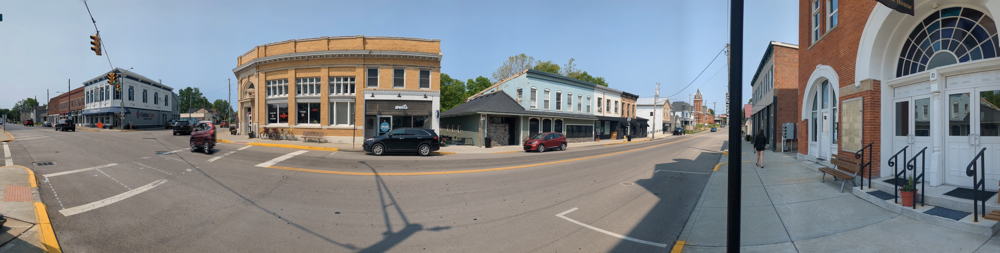 

 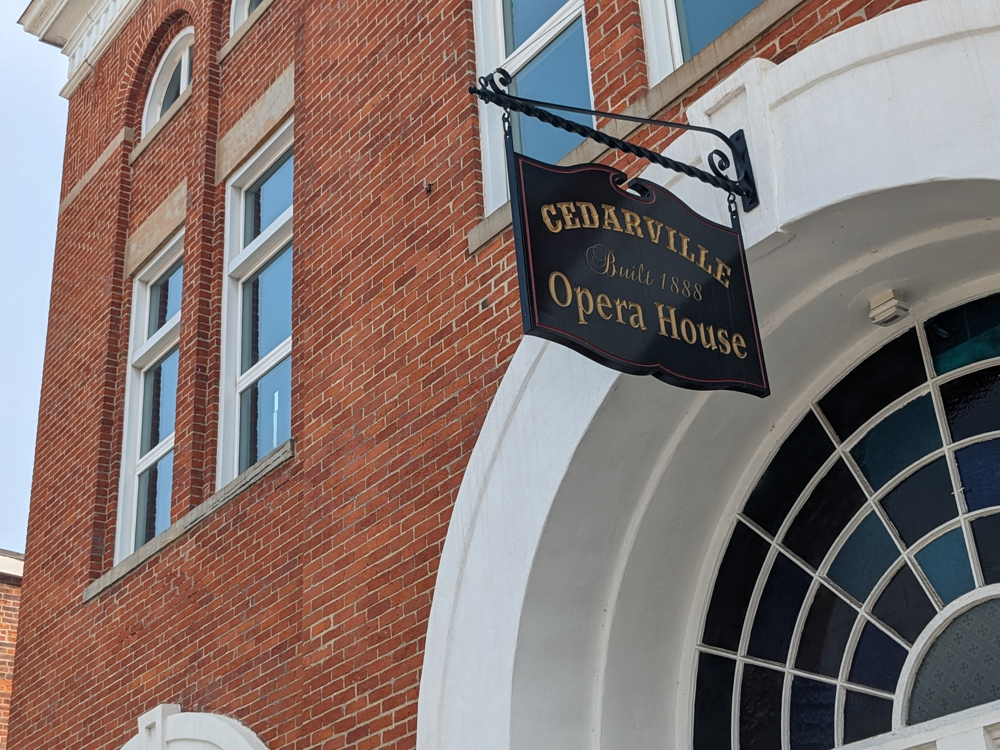

The Ohio-to-Erie trail was fantastic riding.  There was a lot of stretches where you're just in a green tunnel, or next to a cornfield, but it never gets too monotonous as it's often broken up by the numerous small towns that dot the route.  The road is (mostly) paved, and relatively flat, making for a nice easy ride.

   

I ended up stopping for lunch in South Charleston, OH around 1PM.  I did a quick scout around of the town to see what South Charleston had to offer, but on a Sunday, the answer was "not much".  I ended up stopping at a nice lunch shop right off of the path, Purple Monkey Pizza.  I thought pizza sounded like a bit much to order 4 hours into my multi-day trip, so I ended up ordering an Italian sub instead.  In retrospect, the pizza would've been the better choice as I would have a lot of sandwiches in my future, but I hadn't thought that far.  It was a great tasting sub though, and would definitely recommend Purple Monkey for future travelers on the Ohio-to-Erie trail.

Sitting outside of the Purple Monkey, you really got to see how many other travelers there are on this trail.  I didn't expect it this early in the season, but there were quite a few bike tourists heading back and forth!

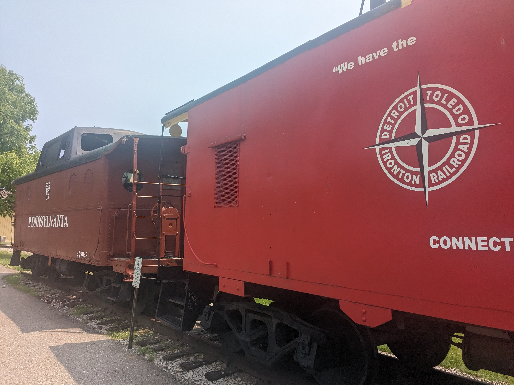  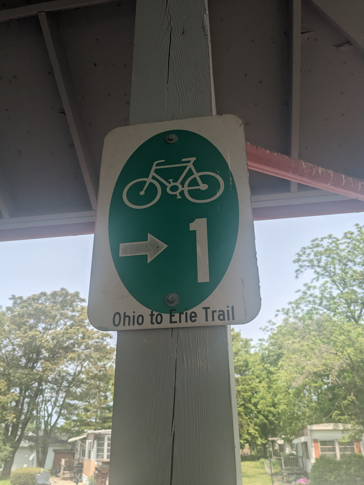 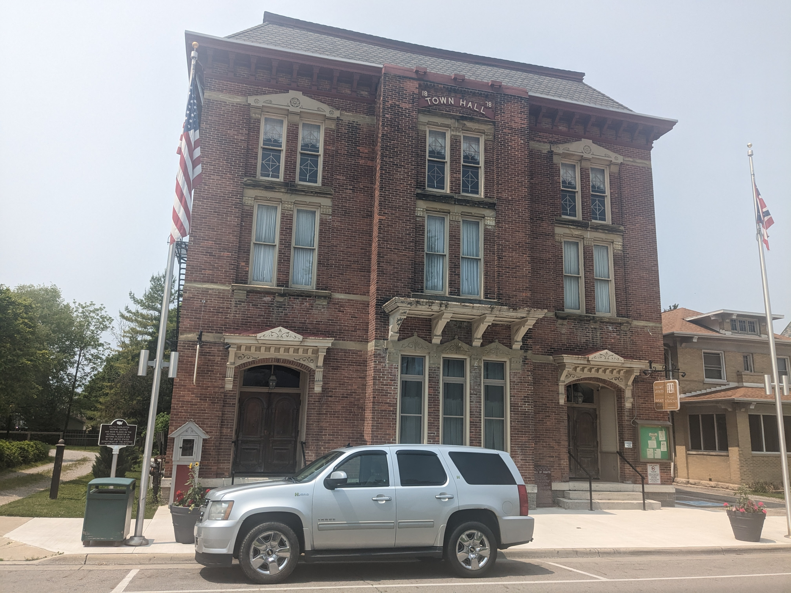 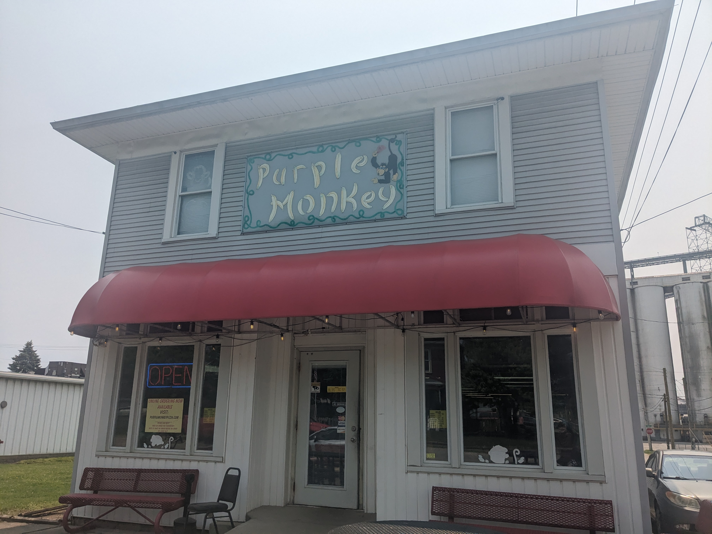 

My last milestone before the end of day 1 was London, Ohio.  It was quite nice!  They had a trail-side campground for slow travelers that I probably would've stayed at had I not had lodging planned on Columbus.  I looked around downtown for some ice cream...I was hoping to making "stopping for ice cream" a "thing" on this trip...but unfortunately, I was again foiled by being in a small town on a Sunday.  Save for McDonald's, there were no ice cream shops open when I was riding through.  After another brief stop to apply sunscreen, I was on my way to Columbus.

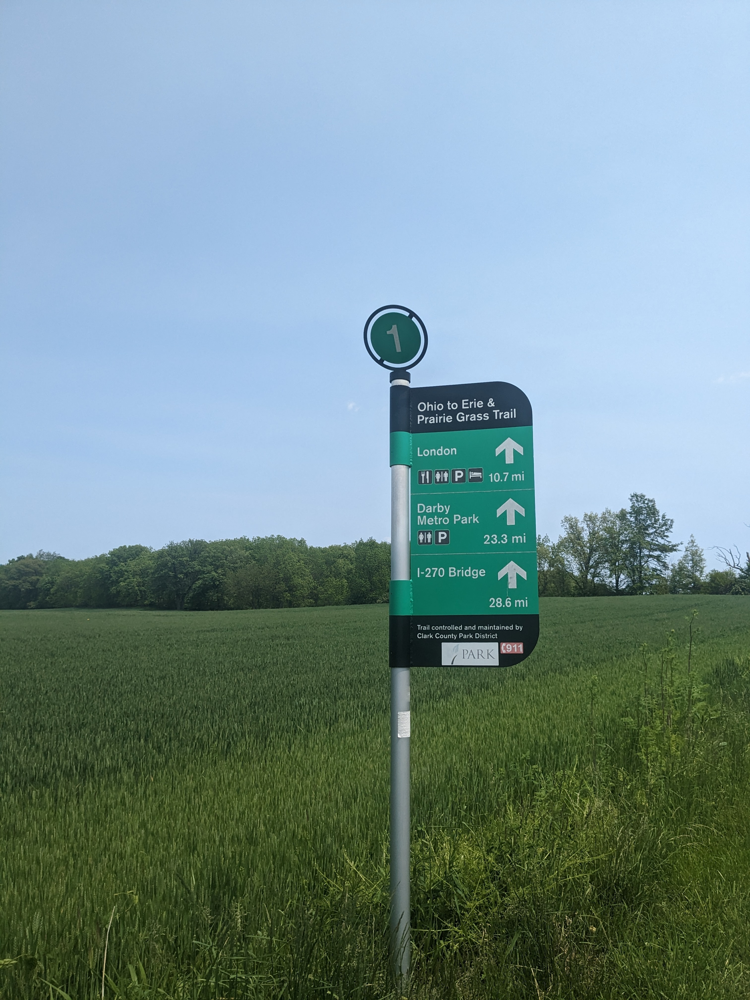  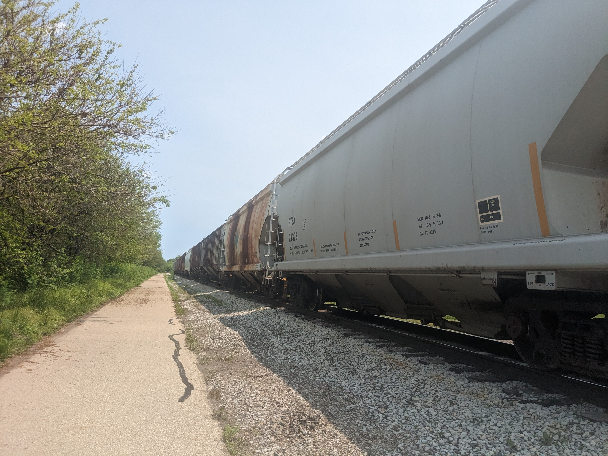 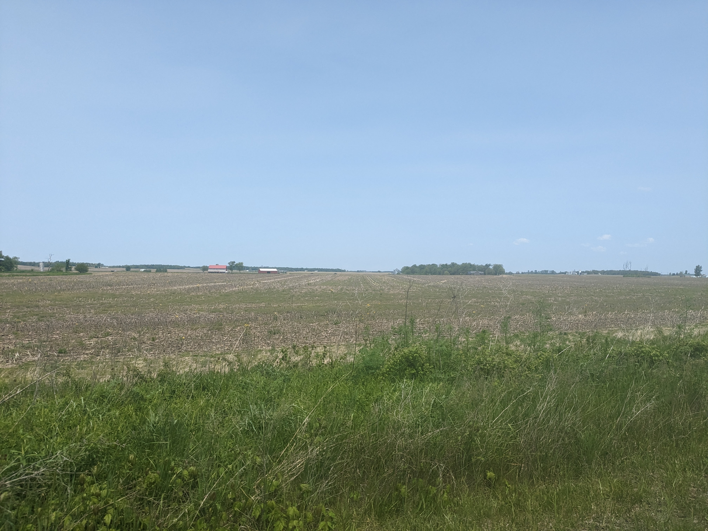

   

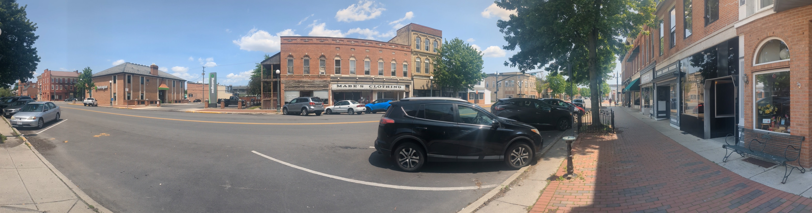

I had a bit of a hiccup getting out of London where my GPS wasn't quite sure where I was (my GPS apparently will sometimes have to guess if I'm on a trail or on a road when they're right next to each other, and if it guesses wrong, it refuses to correct itself even when the two diverge), but luckily it was the only trail out of town so I couldn't really get that lost.

Just outside of Columbus, I hit a bit of an interesting part of trail as I passed through Battelle Darby Creek Metro Park:  While the entirety of the trail up to this point had been nice and paved, this bit broke off into a dirt-and-gravel forest path!  I thought it broke up the ride to that point quite nicely; My hybrid bike can handle small gravel portions and the grade is pretty flat in this part of Ohio, so it wasn't really that difficult to traverse.  Little did I know that this little trail was foreshadowing some trials in my future...

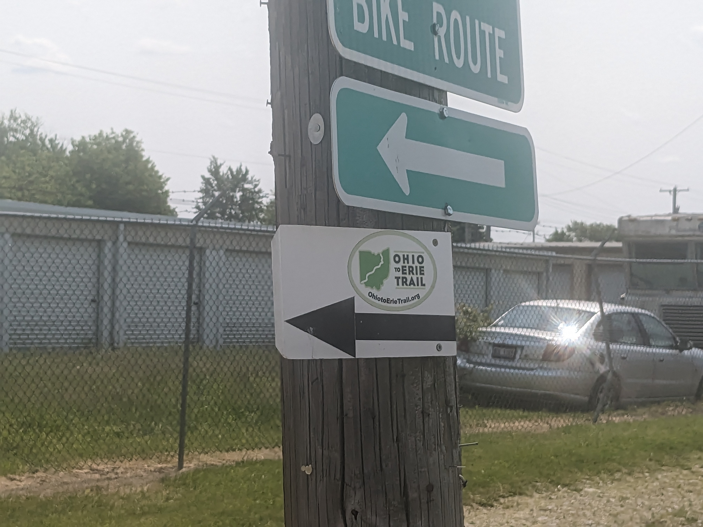  

    

And honestly the rest of the ride to Columbus was pretty uneventful!  I cruised into town at around 4PM, and met up with my friends I was staying with.  We ended up meeting another friend for dinner where I had a decent poke bowl, got talked into some excellent cookies and ice cream (yes!  I got my ice cream for the day), and then just watched friends play Tears of the Kingdom while I tried to figure out how to book my campsite for the next day (the booking website ended up being broken, and I just called and booked the next day on the phone).  I crashed around 9 or 10 PM to try and get my energy for the upcoming rides.

   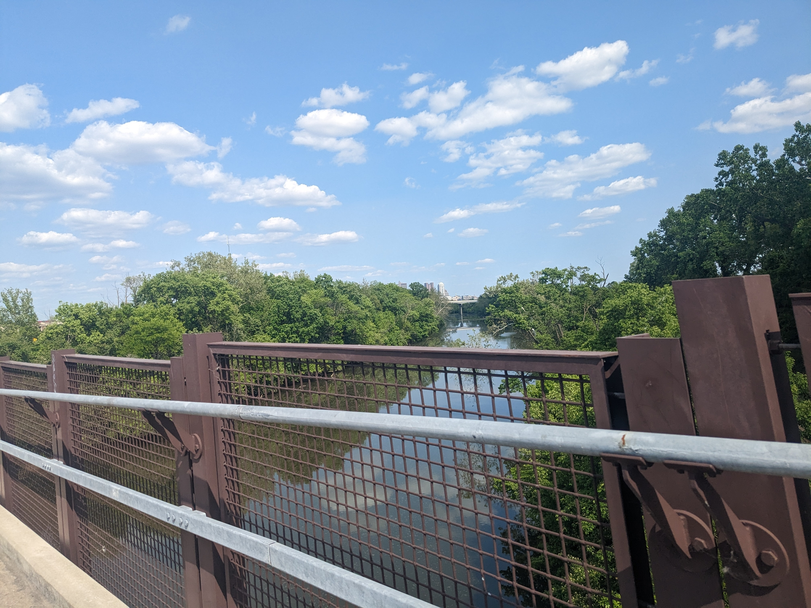 

## Day 2: Columbus, OH to Dillon State Park, OH

I ended up not getting a super restful night sleep, as I woke up in the middle of the night with some pretty not-great stomach pains.  This was my first sign that something was going wrong on the trip, although to this day I'm not quite sure if this was an early warning sign of what was to come, or if I just had some bad fish the night before.  Anyway, I felt pretty good to move on the next day, so I hopped on my bike and started my ride out of Columbus.

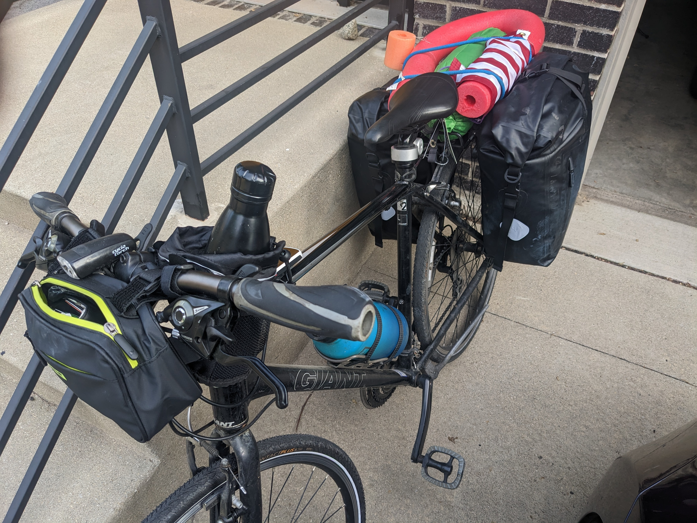 

I'm a sucker for diner food, and since I was waking up within the bounds of civilization, I wanted to try and find a diner at which I could have breakfast.  I ended up picking out Scotty's Cafe in east Columbus, just south of the airport.  Honestly, I wasn't blown away by it, but I don't really have any complaints either!  I ordered eggs and sausage and toast and I received some serviceable eggs and sausage and toast, and what more can one really ask for?

Riding back to my route took me near the Columbus airport, which was quite busy with traffic on a Monday morning. I ended up riding on sidewalks and shoulders where possible, and plowing through the grass where not...thank heavens again for a hybrid bike!  I took a quick stop on the other side of the airport to call the campground and book my site, which was absolutely no problem whatsoever (who goes primitive camping on a Monday?).

I was back on my route although no longer on the Ohio-to-Erie trail.  The trail route headed northeast to Cleveland, and I was heading straight east to Pittsburgh. However, Columbus does have some great bike trails, and the first half of the day took me alternately through some small trails and suburban streets.

I took a quick stop in Gahanna, just outside of the Columbus loop for some supplies.  I saw a Whit's custard there, which was pretty neat.  We very recently got a Whit's in Dayton, and so it caught my eye when I saw it.  I also ended up passing a farmers market along the way where I bought some fresh peaches...I thought adding some more sugar into my breakfast would help me power through to lunch.  I ended up not being hungry for all of them (and they weren't that big to begin with, these are Ohio peaches not Georgia peaches) but enjoyed the ones I did have.

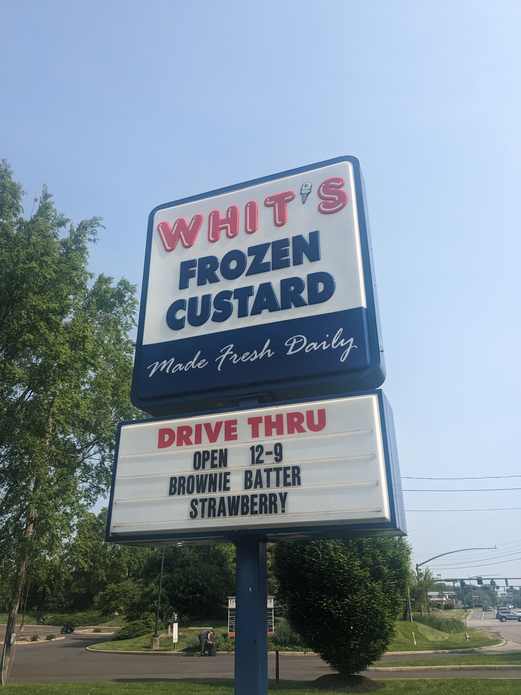 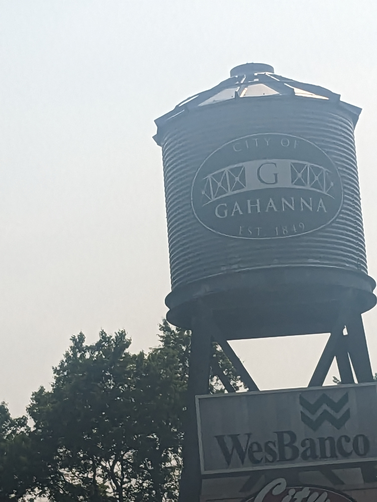 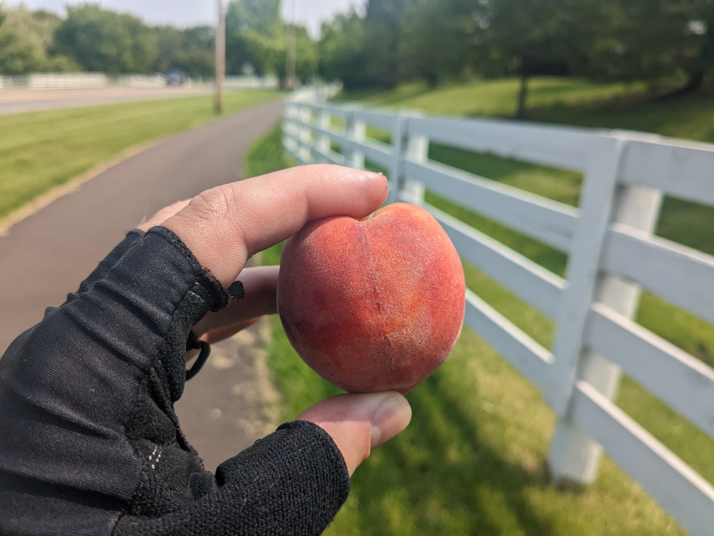

 

My next leg of the trip took me to Granville, and, honestly, this bit was pretty miserable. I ended up taking this road parallel to a state route, in the hopes that most of the traffic would prefer to take the much faster state road, leaving my route much more safe and car-free.  While that did work out, the actual riding conditions were pretty miserable. The road was still pretty big, and had no shade whatsoever.  The sun was also beating down pretty hard this morning, and this entire stretch was basically one gradual uphill for a solid hour.  While I did have plenty of water with me, I was definitely very hot and tired by the time I turned off of this bit.

Interestingly though, I still ended up passing a ton of bike tourists going the other direction!  I would eventually pick up a trail closer to Granville, so it seemed it was not uncommon for local cyclists to use this miserable road to extend their trip on the bike path as well.

I ended up taking a break about 3 miles out of Granville, as my butt was really feeling having been on the bike for so long and I was feeling pretty overheated from my ride up to this point.  After a rest, I started down the "T.J. Evans Trail" into Granville. Granville ended up being a very bike friendly community, with several amenities right on the bike path, and lots of bike racks in the downtown area.

While there, I stopped and grabbed lunch at "Day Y Noche", an excellent Mexican restaurant in town.  I ended up not being very hungry for lunch, which worried me a little bit, as I was burning 3000 calories per day, and I new I needed to be replenishing.  But, I wasn't too worried about a single light meal...after all I was still a little overheated, and my stomach was a little rumbly from last night.  I also found _another_ Whit's Custard in town, and taking it as a sign, had some key lime ice cream for dessert, which helped me cool down substantially.

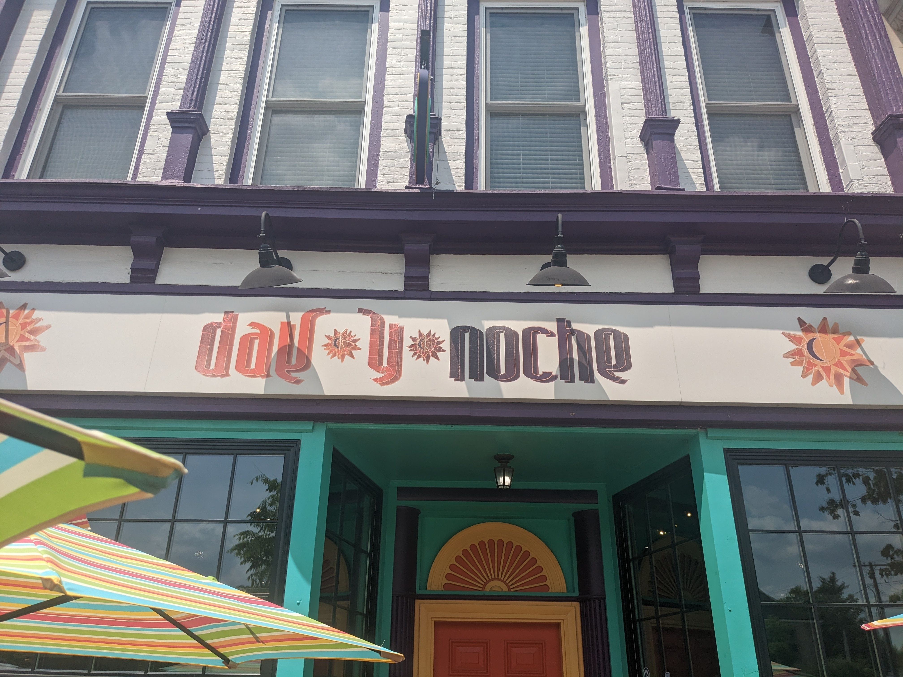 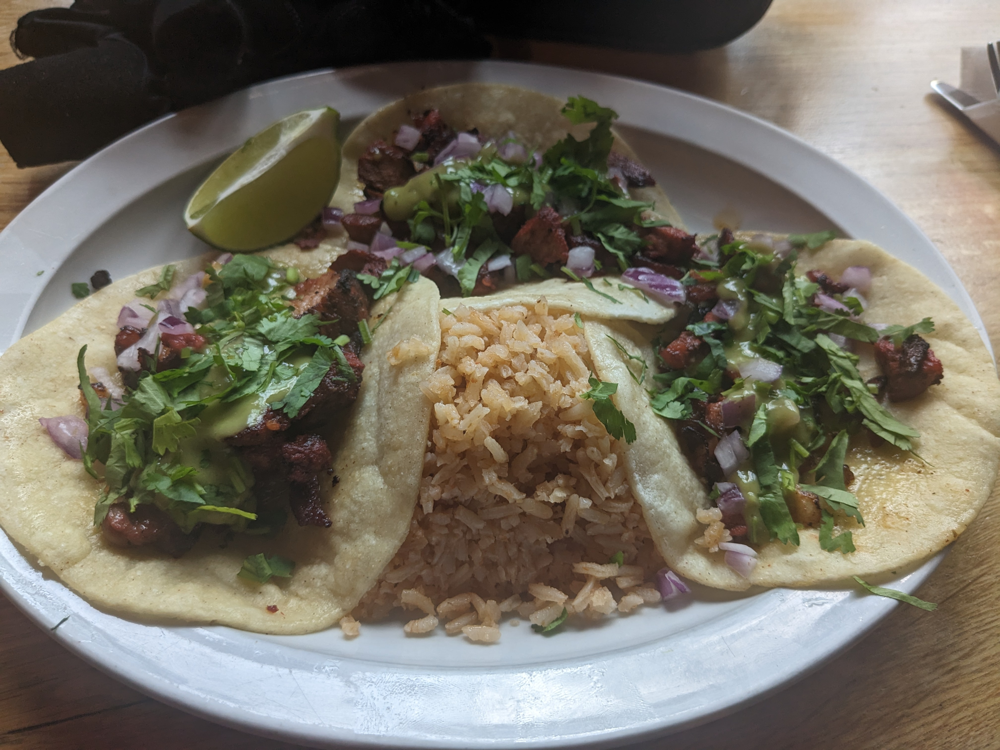 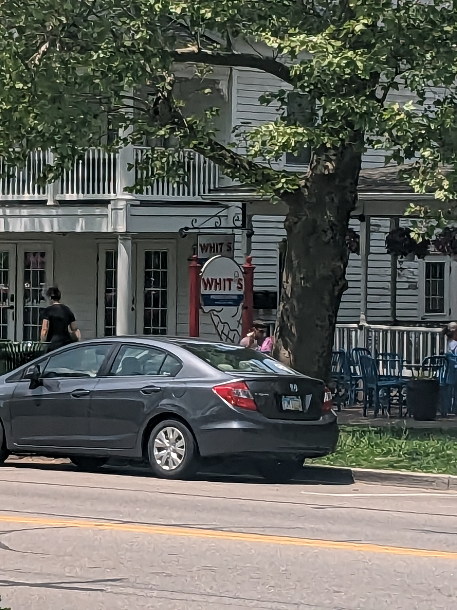 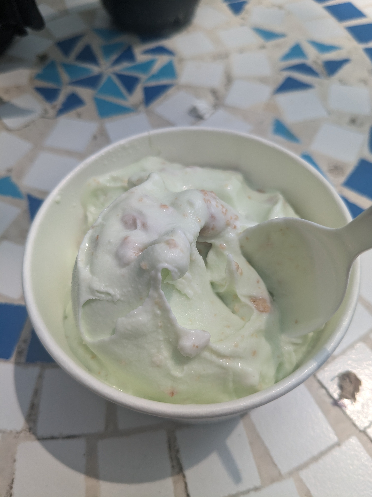 

My last stop of the day was Newark, Ohio, a town in which there was not too much of note.  The ride to get there was quite easy, half of it was on the same bike path through Granville, and then a short road into downtown Newark.  Even through it had been less than an hour since I ate lunch I wanted to pick up dinner in Newark.  I knew it would be unlikely I'd have any food options when I got to the campground, so I figured buying dinner ahead of time and then bringing it with me was my best shot. 

I found a local deli (Chickie's General Store) where I could get a sub sandwich and, reasoning that I still needed to catch up on calories for the day, chose to order the whole sub instead of the half sub.  This ended up being a whole lot of sub sandwich...I had to strap it to the back of my bike next to the tent!

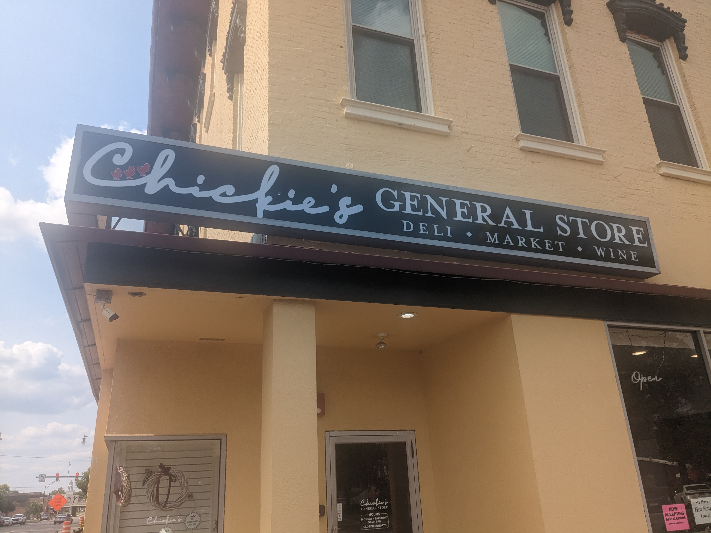 

My route out of Newark continued me on the T.J. Evans trail for another hour, which was a nice surprise, as I thought I would be on roads the rest of the way.  It was gradually uphill, but I'll take a gradual uphill on a trail rather than being hit by a car any day.

Another nice surprise was that I got to ride within view of the Longaberger Basket building!  While planning this trip I new that I wouldn't be too far away from it, but I had thought I ultimately had chosen a route that wouldn't take me near it.  Spying it through the trees was an excellent surprise!

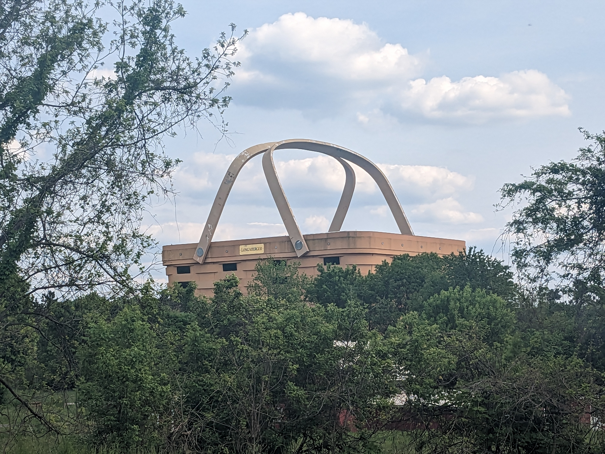

The last bit of trip involves me riding down OH-146, which was a terrifying nightmare.  As a general rule I try and stay away from state routes as they tend to be heavily trafficked, but sometimes there is no way around it.  There were a lot of cars driving very fast on this road, and it generally did not feel super safe.  The America Noodle did the most work today for sure at encouraging cars to drive a safe distance away.

I eventually arrived at the campground, and found my campsite.  My tent was new for this trip, luckily it was easy to set up (and much more roomy than my old 1 person tent!).

Unfortunately, even after bumming around the campsite for a while, I never quite got my appetite for dinner!  At this point, I was going to end up seriously calorie deprived for the day.  I ended up eating half of my sandwich, but really had to work to get the end of it down, and eating the other half was _not_ going to happen.  I was worried at this point about how I was going to feel tomorrow, but given that I didn't really have any choice, I resolved to simply eat more tomorrow to make up for it.

 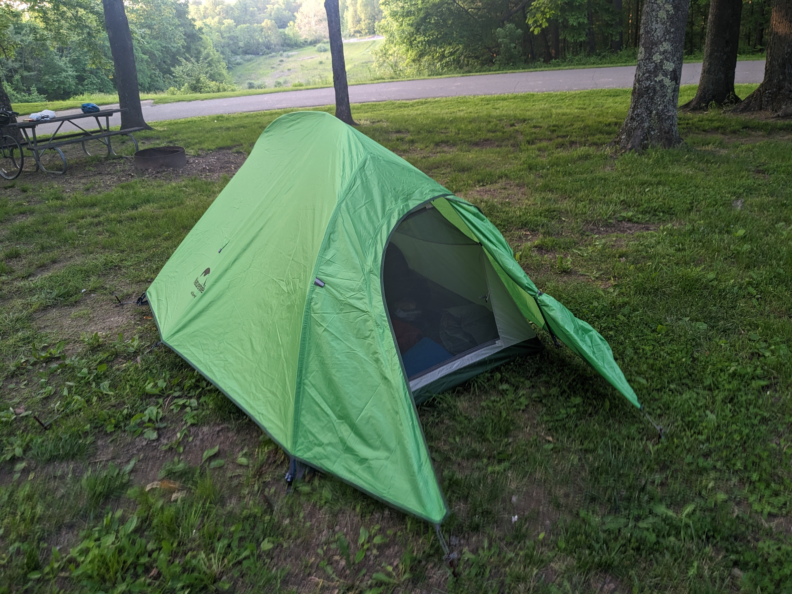 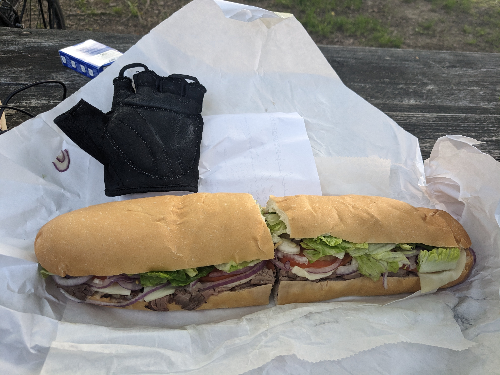

## Day 3: Dillon State Park, OH to Salt Fork State Park, OH

Sleeping was tough as there was deer that multiple times through the night kept trying to get into my tent, and I kept waking up to sniffing sounds and things brushing against my tent...not very optimal.  But, I survived the night and was ready to go the next morning.

Traffic on OH-146 was just as bad as it was the preceding afternoon, but luckily I was on it for a much shorter stretch before being able to pull off and take some back roads to Zanesville.

   

 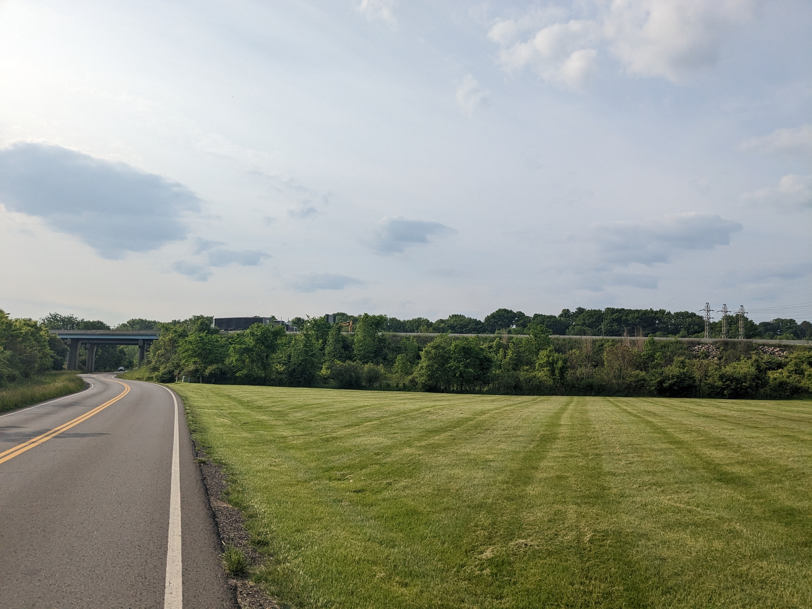 

Zanesville had a few touristy things I wanted to see before I left town. The Y bridge is pretty iconic to Zanesville, a 3 way intersection sitting smack dab in the center of the Muskingum river.  I also wanted to see the river lock in Zanesville, being one of the last hand-operated locks in the country.  The former was pretty cool, the later turned out to be not much to look at when it wasn't actively being operated.  I was also hoping to see Vasehenge, which is exactly what it sounds like, but apparently the art installation had been permanently taken down.

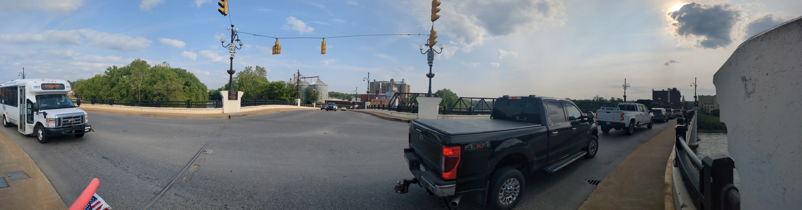

    

After snooping around those locations, I stopped by the local grocery store in order to get some breakfast.  I picked up a bunch of bananas, hoping the fruit would help me stuff some more calories in me to make up for the previous day.  I still wasn't very hungry but the bananas went down okay. 

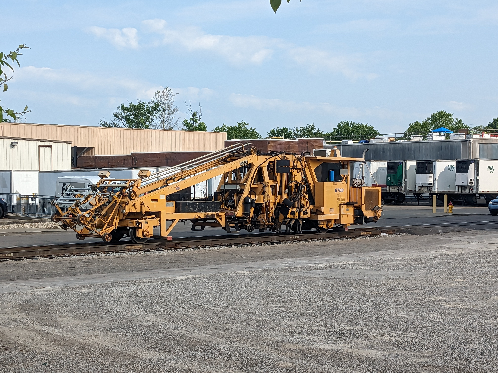 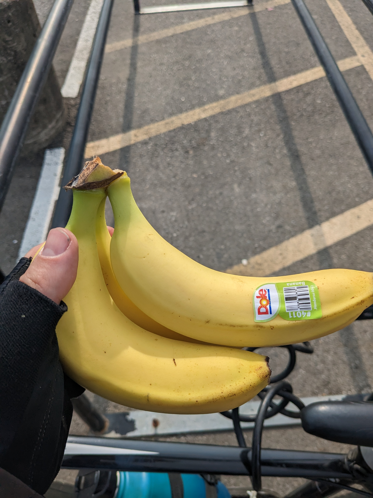 

My way out of Zanesville was along the _Zane's Landing Trail_ along the Muskingum River, which was a pleasant surprise.  I had thought that I would be on roadways until I reached Pennsylvania, so being able to ride on a trail, even for a little bit, was quite nice!

Unfortunately, that's where the pleasantness ended.  I've driven back and forth between Dayton and Pittsburgh a lot, and in my brain, the Appalachia hills didn't start until after Cambridge, either late today or tomorrow.  In actuality, I started getting some rolling hills near the end of my ride yesterday, and after Zanesville, I really started hitting some real inclines.

 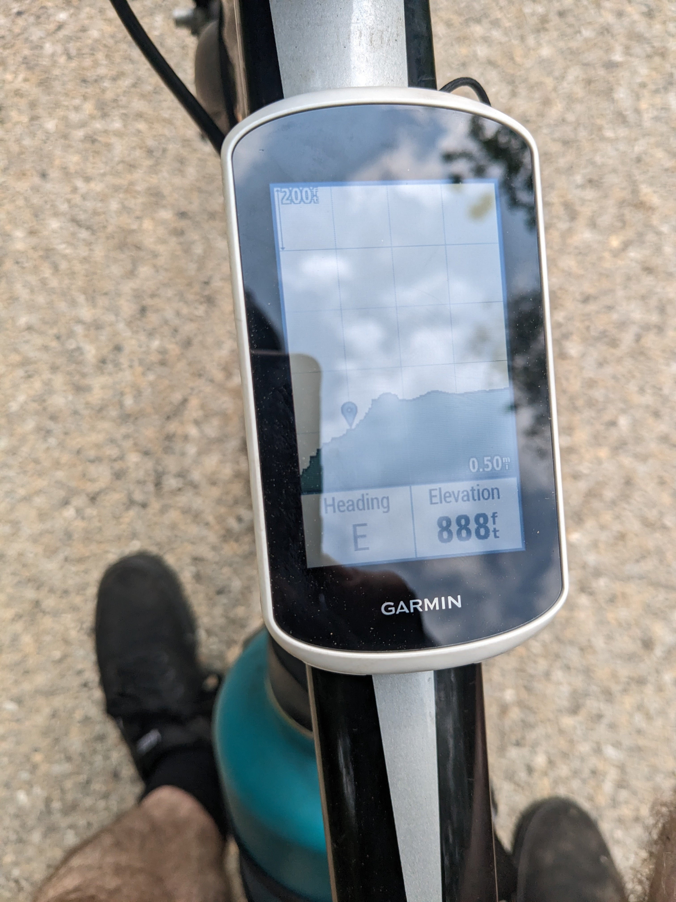

I know a lot of people try and rationalize the uphills by looking forward to the inevitable downhill on the other side.  Unfortunately, as I was spending most of my time at higher altitudes, I actually started to really dread the downhills, as I knew it would be over far too soon and there would just be another uphill on the other side!

Nothing too interesting happened between Zanesville and my next stop, Cambridge.  Other than some gnarly hills it was mostly just riding past farmland for a few hours.

 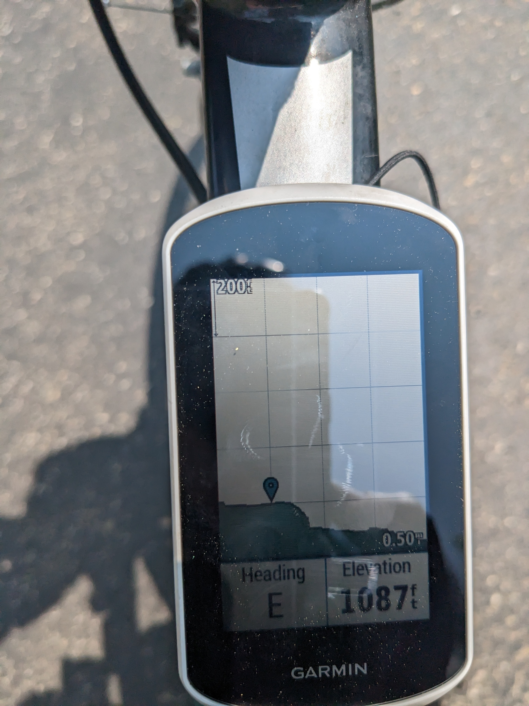  

Now unfortunately, dealing with all the hills meant that I was going a lot slower than I was expecting to, and I ended up having a pretty late lunch in Cambridge.  After searching for what restaurants sounded good, I got some fish and chips at Theo's Restaurant, which were very good.  Unfortunately, my appetite had disappeared again, and it took me about an hour of picking at my lunch to get most of it down, and I still didn't finish all of it.  I was starting to get properly worried at this point, but there was nothing I could really do about it either...I can't eat beyond what my body wanted to eat.  I just resolved to take it easy and make sure I kept my blood sugar up and not press myself too hard.

 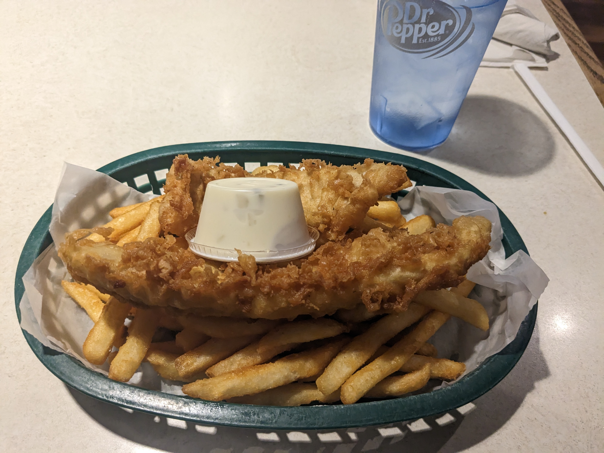

Fun coincidence:  When I was leaving Theo's, I ran into a man with his family who said:  "Hey, didn't I see you cycling around Zanesville this morning?".  Small world!

After popping across the street to McKenna's Market for another to-go sandwich, I was off to my overnight destination, Salt Fork State Park.  Unfortunately, the entrance to the park was at the far side of the park from where I was, and the campsites where at the far side of the park from that, but that was all worked into the plan and there was nothing for it but to keep going.

I made two critical errors when I reached the park, and the first of which was to trust my GPS when it took me from the entrance of the park to my campsite.  The campsite was just off of the main road, which makes a big semicircle through the park.  Error one was that in an effort to save me some time and distance, my route took me through a park back road which cut across the circle.  Here's the problem:  The longer main road turned out to be crushed limestone.  The shortcut?  Big chunky gravel.  Ever try and ride up a steep hill on a fully loaded bike on gravel?  It is _incredibly_ difficult, to the point that I was unable to do it.  It might have been possible on a mountain bike, but on my hybrid I kept losing traction.  I ended up pushing the bike a lot of the way through this shortcut, making it not much of a shortcut after all.

Error number two requires some knowledge of how my bike is packed.  If you look at any of the pictures of my gear, you'll see that I have a small water bottle near my handlebars that I use for drinking while riding, and a larger water bottle on my frame, which I would use to refill my small water bottle when it got empty.  I finished up the last of my handlebar water on entering the park, but saw I only had only a few miles left on my ride...I tragically decided to wait on refilling my water until I reached my campsite, rather than stopping to refill at that point.  Of course, those last few miles took much longer which much more effort than expected, meaning that arrived at my campsite _extremely_ dehydrated.

Setting up camp was definitely an ordeal with the dehydration, but eventually my body recuperated and I was able to get everything together.  Unfortunately my eating problem reached a peak with dinner...I was unable to force down even a single bite of the sandwich I brought with me.  In an effort to get literally any calories into my body I ended up with a dinner of cliff bar, a few raisins, and half a tortilla.  

Obviously this was not nearly enough calories, and I started to really worry about my ability to complete this ride.  I still was somehow not feeling any symptoms of physical fatigue, but I knew it had to be coming and I thought maybe having an escape plan was in order.  My original plan for the next day was going to be to ride to Steubenville, a ride that was going to be just as long as today's but somehow be even hillier (remember, I didn't realize that today would also be full of hills when I planned this route). Looking at the map, I saw that my route would take me through Cadiz, OH, about 2/3rds of the way there, a city that was large enough to have a few hotels of its own.  I had planned a spare day into my trip in case I hit bad weather or needed to take a break, so I figured if I started to gas out early tomorrow I could abort and stay in Cadiz.

Thank goodness for this backup plan.

(One more note:  Sometime during the last hour of this trip, I lost my flag.  The America Noodle is now just the Noodle.)

## Day 4: Salt Fork State Park, OH to Cadiz, OH

This was the worst day of my trip.

When I woke up on this morning, I hit a new wrinkle in my digestive system: diarrhea.  (The more experienced athletes out there may have figured out what was coming but this was still new to me).  I woke up around 6:30 having a pretty sizable bowel movement waiting for me.  Luckily, my tent wasn't far from the latrine!

This day was the worst and most miserable day of cycling I've had in my life.  As I mentioned, the ride was looking to be quite hilly, and the reality didn't disappoint.  While the previous day involved a lot of sustained elevation, with valleys in between, today was a lot of constant uphills and downhills, with very little in the way of breaks in between.

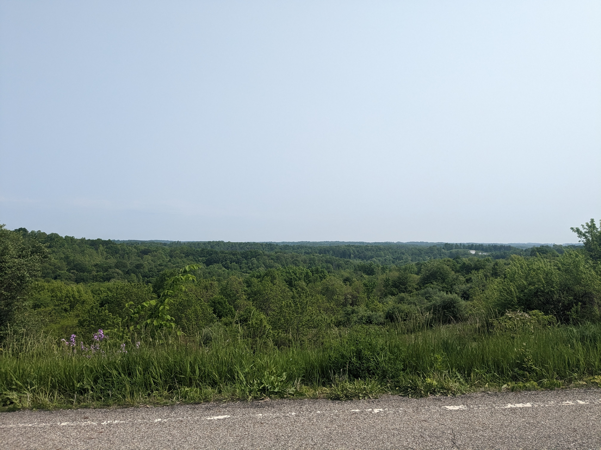

In addition, there was a _lot_ of gravel on this route, something that was not reflected on my planning app.  Trying to travel uphill on a fully loaded bike on some of these gravel roads was basically impossible, and over the course of today I probably ended up walking my bike up 3-5 miles of hills.  Going downhill wasn't much better either, I had to ride the brakes the whole time in order to not crash and burn and gained very little in the way of momentum.

 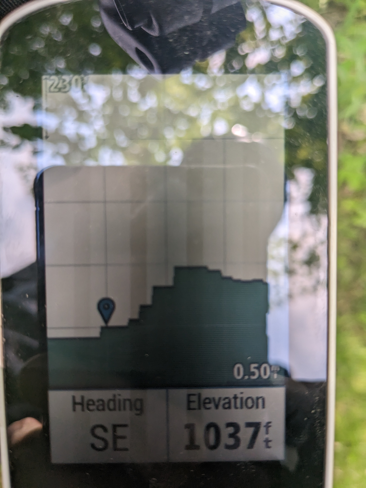

But ultimately, straw that turned today from bad to terrible was the digestive issues.  The diarrhea that started in the morning didn't let up during the ride, and I ended up having to make two emergency stops during the ride to run off into the woods and void my bowels.  Pro-tip: Always take wipes with you on your long rides!

Any experienced athletes have probably deduced what was going on long before now, but as I learned later, I had what is commonly referred to as "Runner's Stomach/Diarrhea".  The general idea is that when you perform a strenuous activity for a long period of time, your body tends to relegate more of your blood and circulation to your muscles, and your digestion uses less of it.  Eventually, the slowed digestion will result in abnormally high levels of bacteria in one's digestive tract which your body will eventually want to get rid of.  This tracks exactly with my experience of being unable to eat, and then suddenly needing to empty my bowels.

By halfway through the ride I had to take a break in Freeport, OH to take a sit-down and drink some water.  If Freeport had a hotel, I probably would've just stopped there for the night!  As it was, I was able to limp into Cadiz and luckily was easily able to find a hotel to stay in.

At my spouse's suggestion, I stopped at a grocery store and picked up a few prepackaged smoothies, thinking that they might be able to go down a bit easier than anything else I was able to eat.  Since I was still operating under the assumption that I had some sort of stomach bug, I also picked up some chicken noodle soup and some saltines.

The rest of my day was spent back and forth between the hotel room bathroom, and lying on the bed watching hours of Bluey.  The smoothies went down okay but even the chicken noodle soup was too rich for how I was feeling.

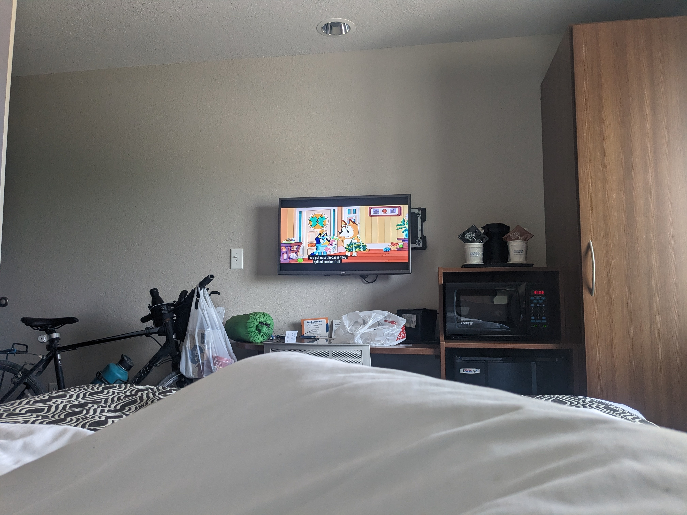

That evening, I was emotionally done.  My butt was fire and I was so weak that I was shaking.  I had already scheduled a call with my parents that night, and during that call I basically asked if I was still feeling terrible in the morning if they could come out and get me (They only lived about 70 minutes away by car from my current location).  I figured I already had the hotel room, and while I doubted that I could go from "literally dying" to "let's do a bike tour" in a single sleep, there wasn't much harm in waiting until the morning to make a judgment call.

## Day 5: Cadiz, OH to Steubenville, OH

Somehow, overnight, I went from "literally dying" to "let's do a bike tour".

Okay so that's maybe a bit of an exaggeration.  But I felt okay when I woke up that morning!  I had a bunch of saltines for breakfast and my stomach didn't hate it.  I purposefully waited and got a late start to see if my stomach would settle, and when I didn't have any major problems after two hours I decided to head out.  I knew that I would be near civilization for the entire ride and it was only 20-25 miles so I should have plenty of places to emergency poop and I wouldn't have far to travel until I was done.

And honestly, the ride wasn't that bad!  There wasn't a lot of traffic until I got close to Steubenville, and then I was able to ride on the sidewalks with no real problems.  There were a few big hills, but nothing like I had to deal with the previous day, and the ride was significantly shorter which helped too.  I did have to pull over once to use the bathroom, but I was able to wait until I reached a Kroger and I bought some more smoothies while I was there anyway.

 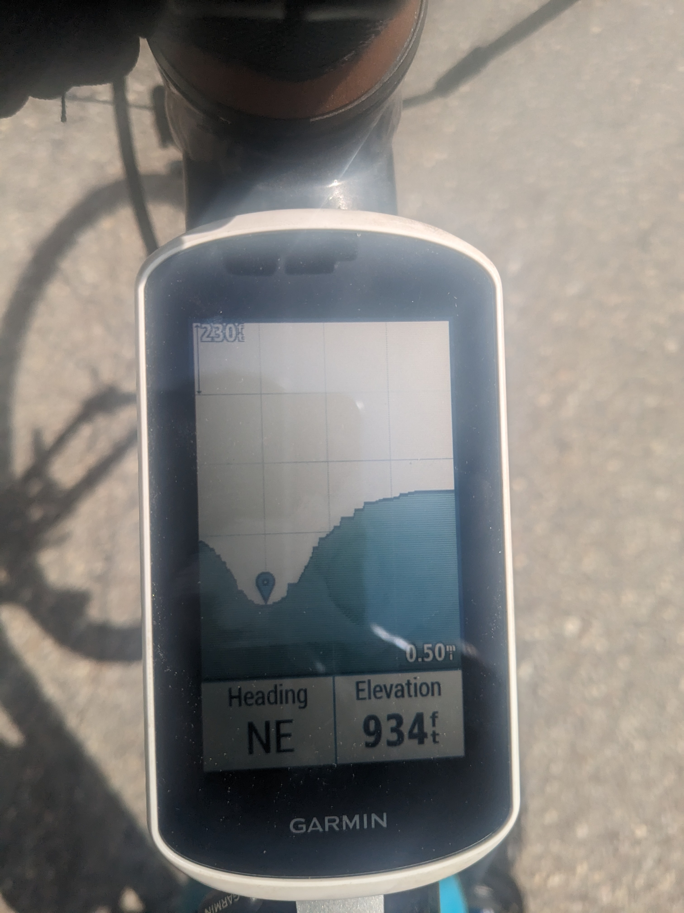 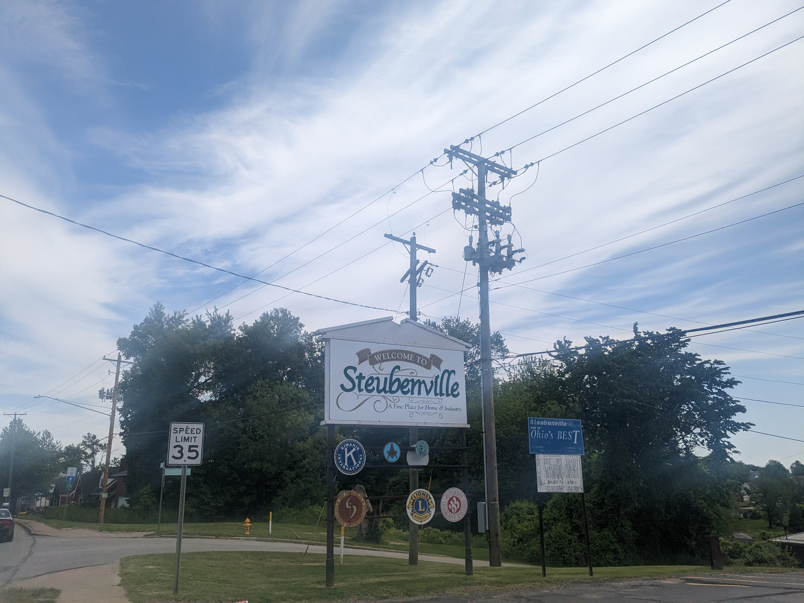

Unfortunately, my stomach did start acting up again a little bit more after my ride ended, so I never really felt comfortable leaving the hotel room and exploring the town.  I mostly spent the day lounging around and watching Star Trek: TNG reruns.  But I wasn't completely bed-bound, with body aches and shivers like I was the previous day...I just had to use the bathroom a bit more than usual.

Dinner was some chicken and vegetable dish from Sesame Grill, an Asian restaurant within walking distance of my hotel.  It wasn't amazing, and I ended up being more in the mood for the rice than anything else. But it was serviceable and I was just happy my body was letting me put calories in it again.

## Day 6: Steubenville, OH to Pittsburgh, PA

Today was the last day.  40 miles, twice as much as yesterday, and my stomach was still not amazing.  However, the vast majority of the day was on a bike trail, and my mapping app was saying no steep hills, just a gradual incline for 20 miles, then a gradual decline for 20 miles.  I was close, and I didn't want to quit now.

The beginning of my ride took my across the Ohio River onto WV-2.  I took the Market St. Bridge across the river which was nice as it gave me a nice view of the river and also had a pedestrian walkway that I could use to avoid the traffic.  Unfortunately once I crossed the bridge, the walkway just...ended? There was a safety barrier along WV-2 and no one really considered what to do with the pedestrian walkway that just ended here.  I eventually ended up trying to time things with the light appropriately where I could hoist my bike over the barrier and sprint across the roadway during a break in traffic.

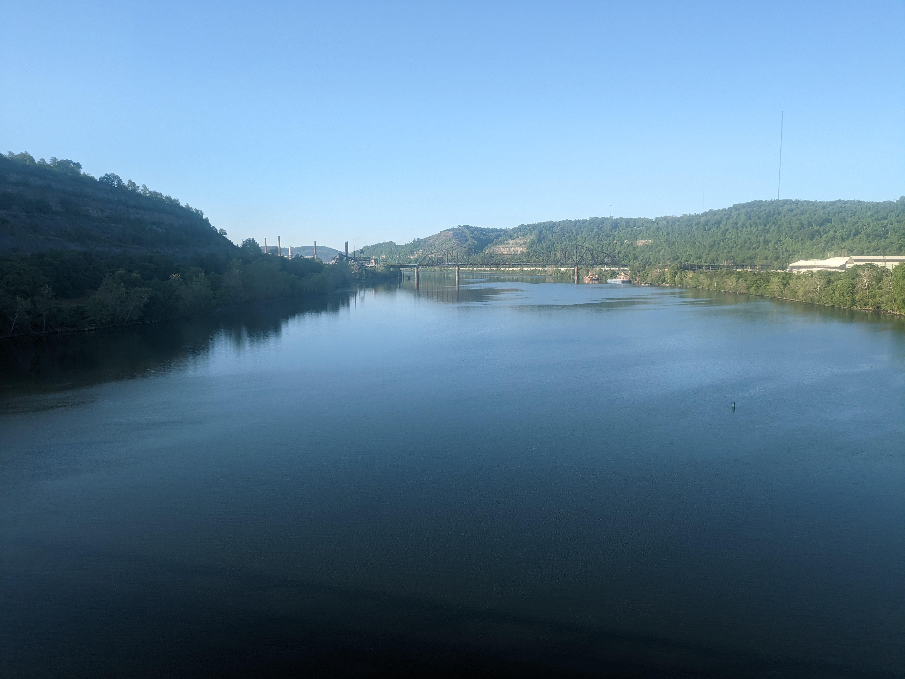 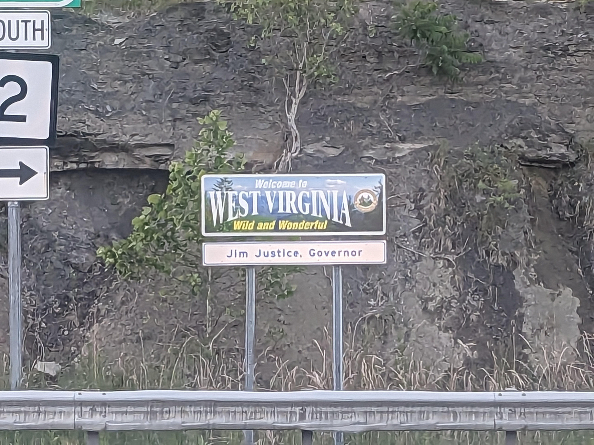 

OH-2 and eventually US-22 where very busy roads that I would normally never consider going on with my bike, but I was only going to be on them for about a mile, and there weren't any other bridges across the Ohio River for miles in either direction, so you take what you can get sometimes.  Luckily for me, both these roads had fat shoulders so I didn't feel too at risk.  And, even better, I ended up getting off the highway at the first exit into Weirton, WV, a nice small town on the other side of the river from Steubenville.  And, after a short ride, I was able to pop on the Panhandle trail.

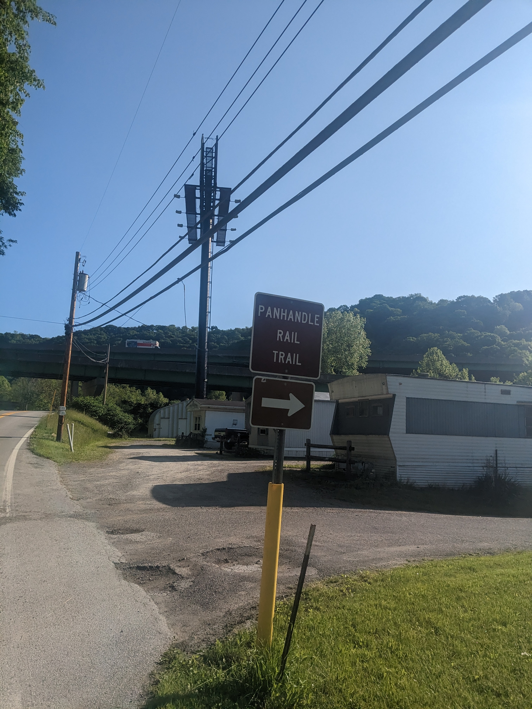  

After the events of the last few days, this trail was lovely.  The nature, the relative flatness of the path, and the complete lack of other cars made it just an extremely pleasant ride.

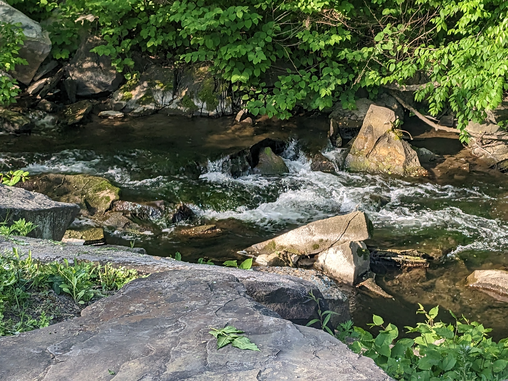 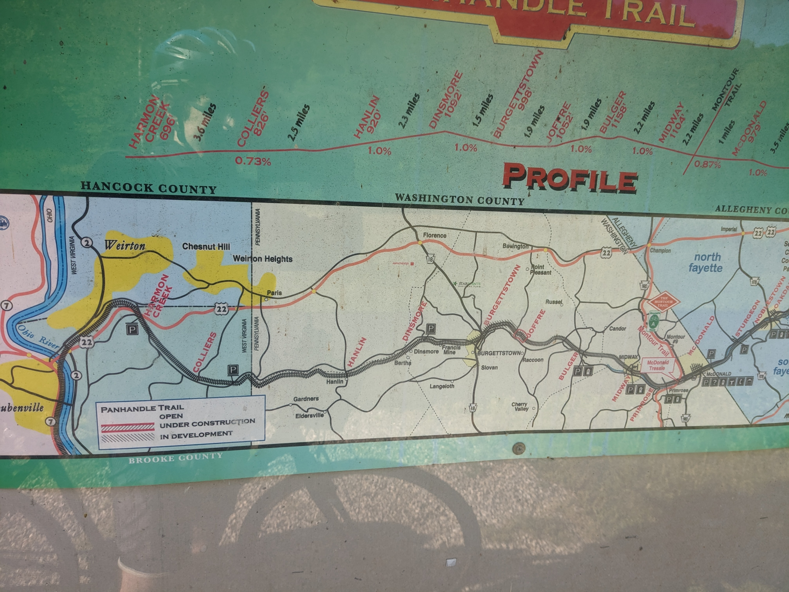  

Along the way I ended up passing the Montour trail, which is an old Pennsylvania rail-trail that I used to ride on as a kid!  Seeing the sign really brought back memories.  I didn't have the stamina to travel this kind of distance back then though so I never ended up on this part.  Still, it was kind of neat that I could've taken this trail all the way back to my parents' house!  Today, however, I wanted to end my ride downtown, so I passed the trail sign and kept moving on.

 

I did still have to make a number of bathroom stops during the trip; my digestive system was still not under control.  However, the trail had a number of trailheads with porta-johns at them, so I was never forced to make an emergency stop.  I just pulled over and emptied my bowels whenever I had the opportunity to, and other than having a _very_ sore butt at this point, I didn't really feel like I was seriously impeded by this issue on my last day.

Eventually once I got close to the city (around Carnegie, PA) I had to leave the trail and continue the rest of the way on roads.  This also meant I had to start dealing with serious Appalachia hills again, but after the nightmare of some of the previous days, having a small number of hills with no gravel wasn't really that bad at all.

And that was really it for the trip!  Eventually I ended up crossing the Ohio River again over to the north side, and then back across to downtown where I was able to wait for my parents to come pick me up in their car.

 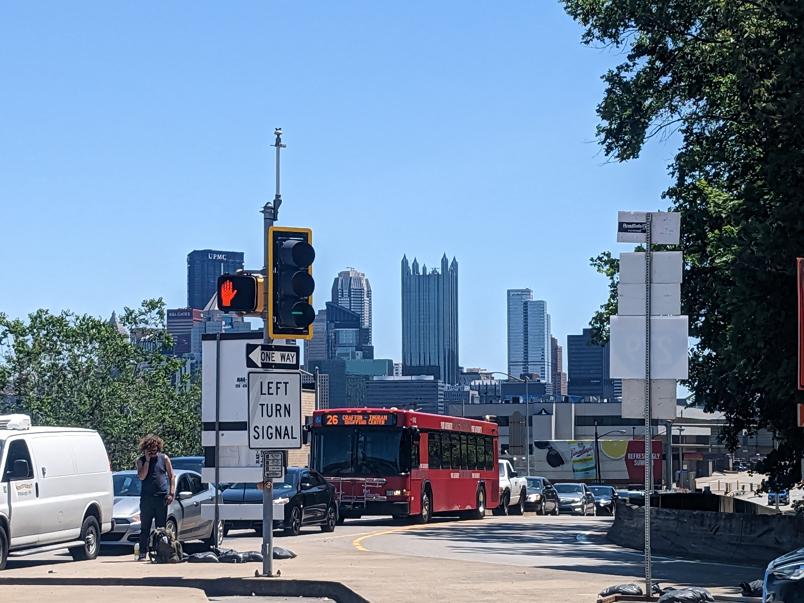 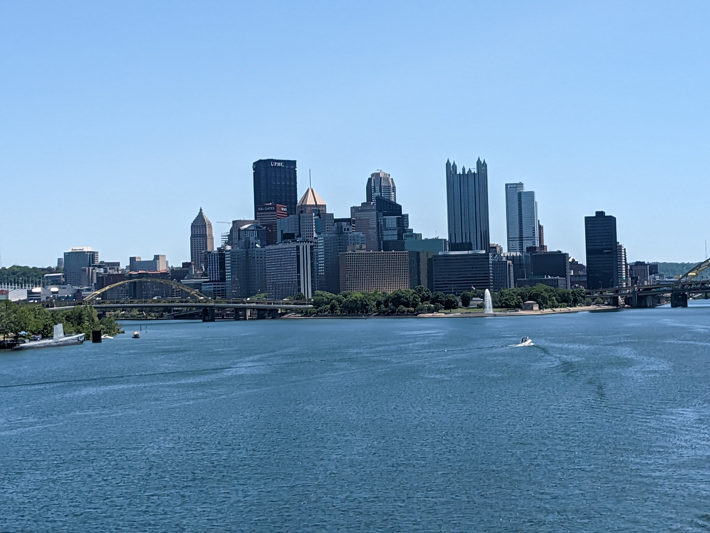
